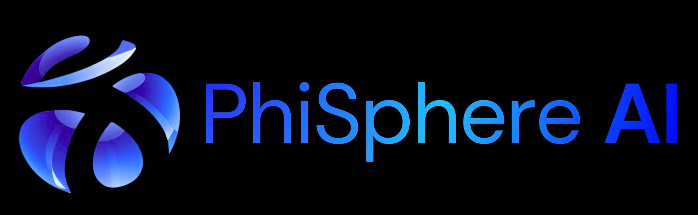
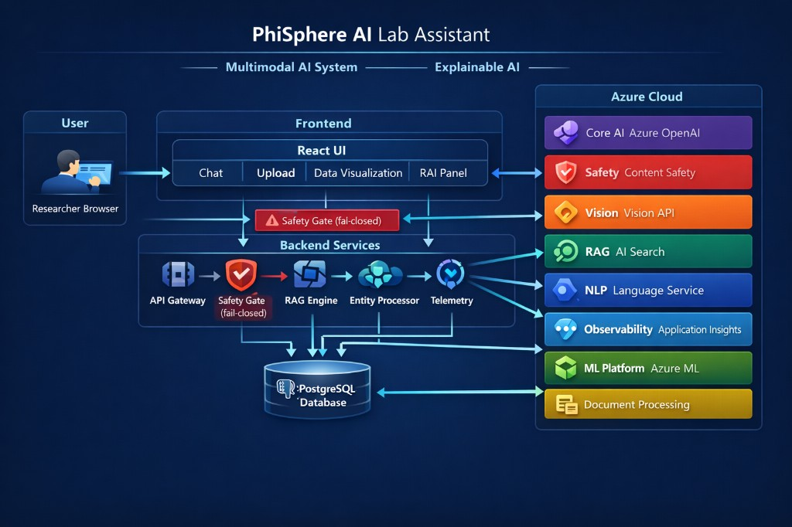
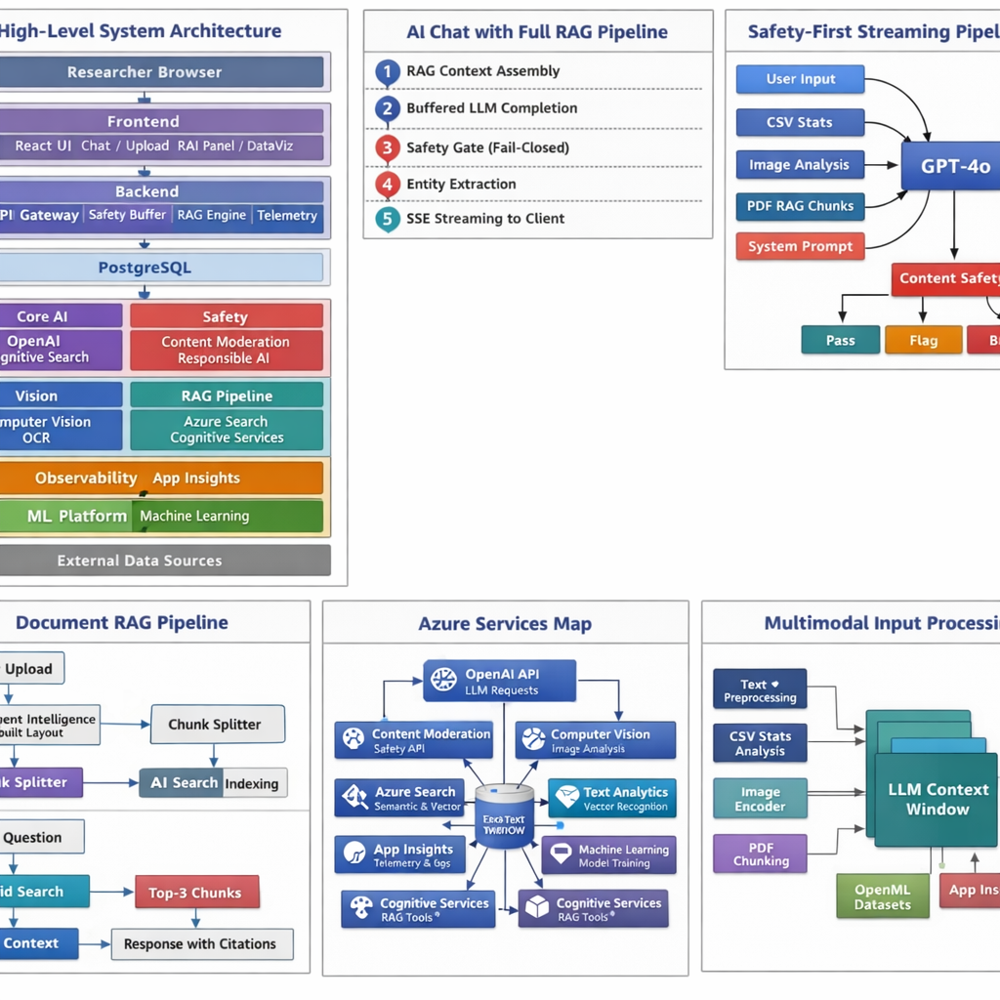
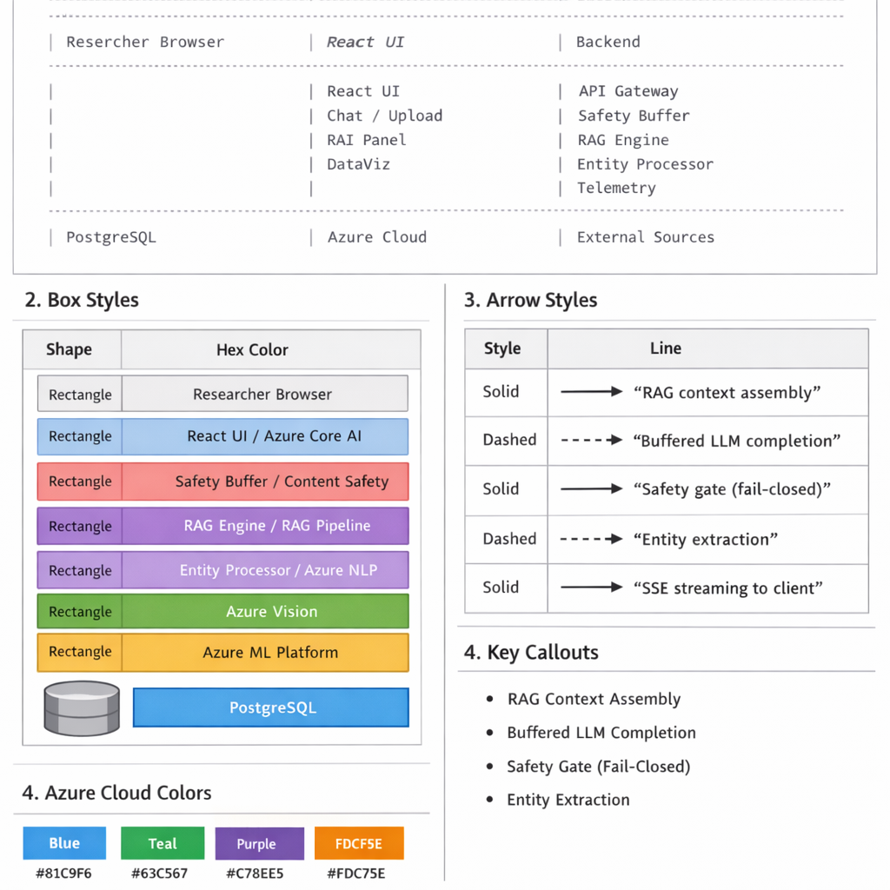
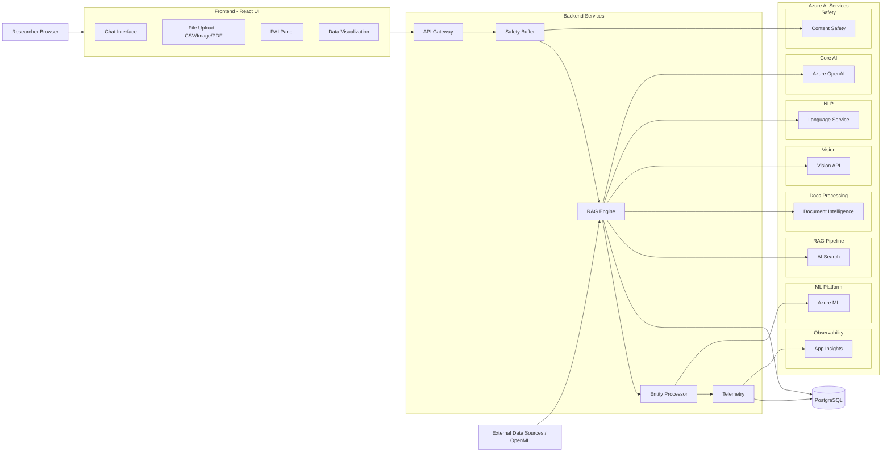
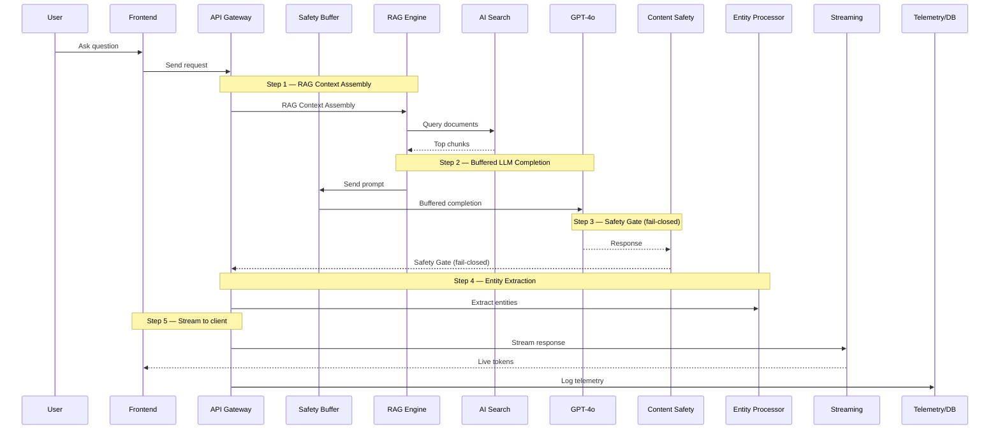
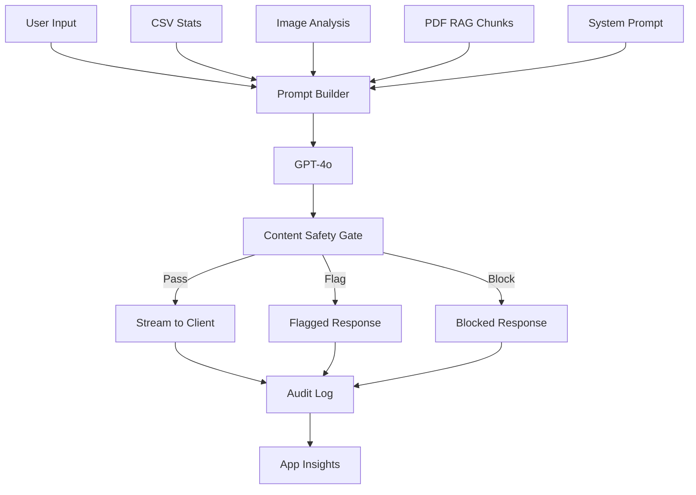
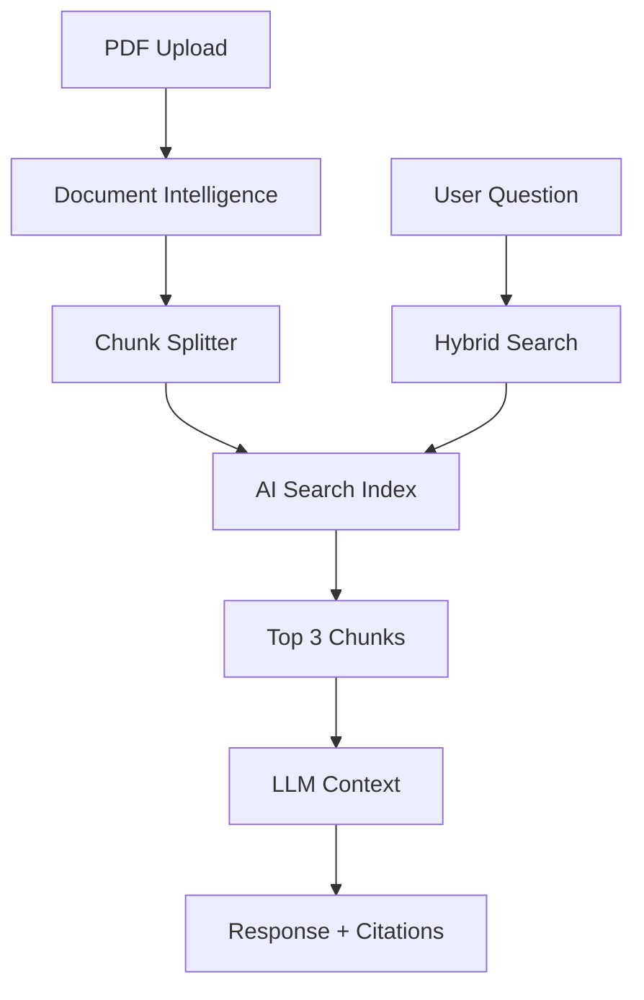
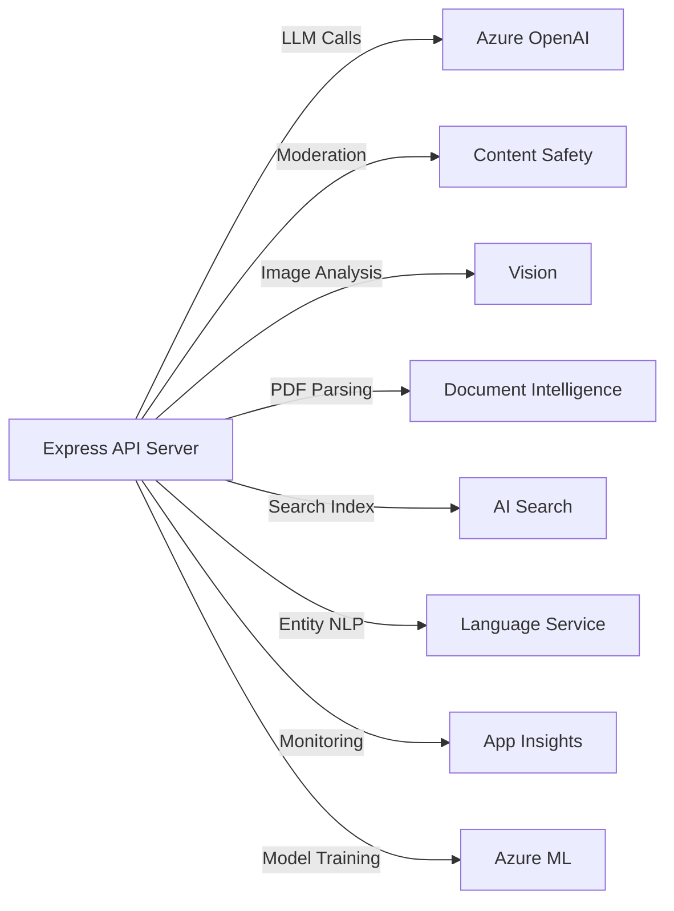
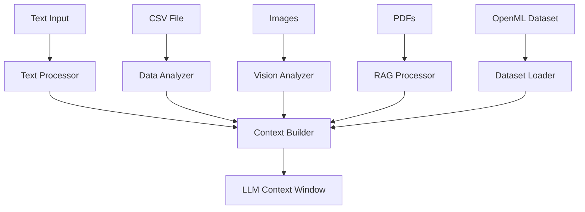

# PhiSphere AI — Lab Notebook AI Assistant

> An agentic lab notebook assistant that helps researchers reason over experiments, analyze multimodal data, and safely suggest next steps — powered by Azure AI.

Built for the **Microsoft Innovation Challenge — March 2026 Hackathon**.

<p align="center">
  
</p>

---

## Intro videos

Two short walkthroughs you can play directly on GitHub once the files are in `videos/`:

### Intro 1

<video src="videos/intro1.mp4" controls playsinline width="100%"></video>

### Intro 2

<video src="videos/intro2.mp4" controls playsinline width="100%"></video>

If playback fails locally, open `videos/intro1.mp4` and `videos/intro2.mp4` in your player, or ensure both files are committed next to this README.

---

## Quick Links for Judges

- Fast project walkthrough: `JUDGES_GUIDE.md`
- Final submission checks: `HACKATHON_SUBMISSION_CHECKLIST.md`
- Backend docs: `artifacts/api-server/README.md`
- Frontend docs: `artifacts/phisphere-ai/README.md`
- API routes map: `artifacts/api-server/src/routes/README.md`
- Shared libs map: `lib/README.md`
- Notebooks guide: `notebooks/README.md`

---

## Screenshots

> **Note:** Replace the placeholder descriptions below with actual screenshots from a running instance.

| Screen | Description |
|--------|-------------|
|  | **Landing Page** — Hero section with feature cards, pricing tiers, and Azure-powered branding |
|  | **Control Panel** — Dashboard with live Azure service status (8 green dots), usage metrics, and recent sessions |
|  | **Lab Notebook** — Chat interface with structured AI responses (Observation → Analysis → Next Steps), CSV chart, and RAI panel |
|  | **Image Analysis** — Gel electrophoresis photo analyzed by Azure AI Vision with captions and OCR |
|  | **PDF RAG** — Document Intelligence extraction → AI Search indexing → citation chips in follow-up chat |
|  | **Content Safety** — Blocked response with safety metadata and audit log entry |
|  | **Metrics Dashboard** — Safety pass rate, groundedness scores, RAG usage, and Azure service health |
|  | **About Page** — System architecture diagram showing all 8 Azure services and Responsible AI principles |
|  | **Azure Architecture Diagram** — Full cloud architecture (committed PNG; see Architecture section for collage + style guide) |

<details>
<summary>How to capture UI screenshots</summary>

1. Start the app locally or on Replit
2. Navigate to each screen listed above (except architecture PNGs, which are already in `screenshots/`)
3. Take a screenshot (e.g., browser DevTools device toolbar at 1280×800)
4. Save images to the `screenshots/` folder at the repo root
5. Commit the folder — the table above will render automatically on GitHub

</details>

---

## Challenge

**Lab Notebook AI Assistant** — Researchers want help reasoning over experiments without replacing scientific judgment. PhiSphere AI interprets experimental protocols, suggests next-step variations, and analyzes results from text, CSVs, images, and PDFs — while clearly explaining *why* recommendations are made. The system enforces strong safety boundaries (especially in biological or clinical domains), applies content filtering, and avoids disallowed advisory behavior.

---

## Architecture

### Visual architecture (included in repo)

These PNGs are **better than placeholders** for judges and slides: they show the full multimodal stack, all eight Azure integrations, and safety-first flow. Mermaid diagrams below stay the editable “source of truth”; the images are for **at-a-glance** reading on GitHub.

**System overview — PhiSphere AI Lab Assistant (multimodal + explainable AI)**


**Six-panel deep dive** (high-level stack, RAG sequence, safety pipeline, document RAG, Azure services map, multimodal inputs)



<details>
<summary>Drawing style guide (layout, box colors, arrows, Azure palette)</summary>



</details>

---

### 1. High-Level System Architecture



### 2. Data Flow — Full RAG Pipeline



### 3. Safety-First Streaming Pipeline



### 4. Document RAG Pipeline



### 5. Azure Services Map



### 6. Multimodal Input Processing



---

### Architecture Drawing Guide

<details>
<summary><strong>Click to expand — full description for drawing in draw.io / PowerPoint / Visio</strong></summary>

Use this to recreate the PhiSphere AI architecture in any drawing tool.

#### Layout (3-column)

```
┌─────────────────────────────────────────────────────────────────────────────┐
│                         PHISPHERE AI ARCHITECTURE                          │
├────────────────┬──────────────────────────┬─────────────────────────────────┤
│                │                          │                                 │
│   FRONTEND     │      BACKEND             │     AZURE AI SERVICES           │
│   (left)       │      (center)            │     (right — blue cloud box)    │
│                │                          │                                 │
│ ┌────────────┐ │  ┌──────────────────┐    │  ┌───────────────────────────┐  │
│ │ PhiSphere  │ │  │ API Gateway      │    │  │ 1. Azure OpenAI (GPT-4o) │  │
│ │ React UI   │──→ │                  │───→│  │    Purple box             │  │
│ │            │ │  │ • Auth           │    │  └───────────────────────────┘  │
│ │ • Chat     │ │  │ • Rate Limiting  │    │                                 │
│ │ • Upload   │ │  │ • Health Checks  │    │  ┌───────────────────────────┐  │
│ │ • CSV Viz  │ │  ├──────────────────┤    │  │ 2. Content Safety         │  │
│ │ • RAI Panel│ │  │ Safety Buffer    │───→│  │    Red box — FAIL-CLOSED  │  │
│ │ • Entities │ │  │ (full response   │    │  └───────────────────────────┘  │
│ └────────────┘ │  │  before stream)  │    │                                 │
│                │  ├──────────────────┤    │  ┌───────────────────────────┐  │
│    ↑ SSE       │  │ RAG Engine       │───→│  │ 3. AI Vision              │  │
│    Stream      │  │ (context build)  │    │  │    Blue box               │  │
│                │  ├──────────────────┤    │  └───────────────────────────┘  │
│                │  │ Entity Processor │───→│                                 │
│                │  ├──────────────────┤    │  ┌───────────────────────────┐  │
│                │  │ Telemetry        │───→│  │ 4. Document Intelligence  │  │
│                │  └────────┬─────────┘    │  │    Teal box               │  │
│                │           │              │  └──────────┬────────────────┘  │
│                │           ▼              │             │ chunks             │
│                │  ┌──────────────────┐    │             ▼                    │
│                │  │ PostgreSQL       │    │  ┌───────────────────────────┐  │
│                │  │ • Lab Sessions   │    │  │ 5. AI Search (RAG)        │  │
│                │  │ • Conversations  │    │  │    Blue box               │  │
│                │  │ • Messages       │    │  └───────────────────────────┘  │
│                │  │ • Safety Audit   │    │                                 │
│                │  └──────────────────┘    │  ┌───────────────────────────┐  │
│                │                          │  │ 6. AI Language (NER)      │  │
│ ┌────────────┐ │                          │  │    Green box               │  │
│ │ External   │ │                          │  └───────────────────────────┘  │
│ │ • OpenML   │──→  (dataset import)       │                                 │
│ │ • Kaggle   │ │                          │  ┌───────────────────────────┐  │
│ └────────────┘ │                          │  │ 7. Application Insights   │  │
│                │                          │  │    Orange box              │  │
│                │                          │  └───────────────────────────┘  │
│                │                          │                                 │
│                │                          │  ┌───────────────────────────┐  │
│                │                          │  │ 8. Azure ML               │  │
│                │                          │  │    Purple box (dashed)     │  │
│                │                          │  │    Offline notebooks       │  │
│                │                          │  └───────────────────────────┘  │
└────────────────┴──────────────────────────┴─────────────────────────────────┘
```

#### Boxes to draw

| # | Box Label | Color | Shape | Notes |
|---|-----------|-------|-------|-------|
| — | **PhiSphere UI** | Dark / Teal | Rounded rectangle | Chat, Upload, CSV Viz, RAI Panel, Entity Chips |
| — | **Backend Services** | Blue | Rounded rectangle | API Gateway, Safety Buffer, RAG Engine, Entity Processor, Telemetry |
| — | **PostgreSQL** | Slate/Gray | Cylinder (database) | Lab Sessions, Conversations, Messages, Safety Audit Log |
| 1 | **Azure OpenAI** | Purple `#7B2FF7` | Rounded rect + Azure icon | "GPT-4o — Scientific Reasoning" |
| 2 | **Content Safety** | Red `#E74C3C` | Rounded rect + shield icon | "Fail-Closed Content Moderation" |
| 3 | **AI Vision** | Blue `#0078D4` | Rounded rect + eye icon | "Captions • OCR • Object Detection" |
| 4 | **Document Intelligence** | Teal `#00B4D8` | Rounded rect + doc icon | "PDF → Structured Text Chunks" |
| 5 | **AI Search** | Blue `#0078D4` | Rounded rect + search icon | "Vector + Keyword RAG — Top-3 Citations" |
| 6 | **AI Language** | Green `#2ECC71` | Rounded rect + text icon | "Named Entity Recognition" |
| 7 | **App Insights** | Orange `#F39C12` | Rounded rect + chart icon | "Telemetry • Custom Events" |
| 8 | **Azure ML** | Purple `#9B59B6` | Dashed rounded rect | "RAI Toolbox Notebooks — Offline" |
| — | **OpenML / Kaggle** | Light blue | Small rounded rect | External data sources |

#### Arrows to draw

| From | To | Label | Line Style |
|------|----|-------|------------|
| Browser | PhiSphere UI | HTTPS | Solid |
| PhiSphere UI | API Gateway | SSE Streaming | Solid, bold |
| API Gateway | Safety Buffer | | Solid |
| Safety Buffer | RAG Engine | | Solid |
| RAG Engine | Entity Processor | | Solid |
| Entity Processor | Telemetry | | Solid |
| RAG Engine | PostgreSQL | Read/Write | Solid |
| Telemetry | PostgreSQL | Audit log | Solid |
| RAG Engine | Azure OpenAI | LLM Calls | Solid |
| Safety Buffer | Content Safety | Moderation | Solid |
| RAG Engine | AI Vision | Image analysis | Solid |
| RAG Engine | Document Intelligence | PDF parsing | Solid |
| Document Intelligence | AI Search | Index chunks | Solid |
| RAG Engine | AI Search | Query documents | Solid |
| RAG Engine | AI Language | Entity NLP | Solid |
| Telemetry | App Insights | Monitoring | Solid |
| Entity Processor | Azure ML | Model training | Dashed |
| OpenML | RAG Engine | Dataset import | Solid |

#### Azure cloud region box

- Background: Light blue `#E8F4FD` with blue border `#0078D4`
- Header: "Azure AI Services" with Azure logo
- Arrange the 8 service boxes in a 2x4 grid inside this cloud box
- Footer text: **"8 Azure AI Services | Safety-First Architecture | Responsible AI Principles"**

</details>

---

## Judging Alignment

| Criterion (25% each)         | How PhiSphere addresses it |
|------------------------------|---------------------------|
| **Performance**              | SSE streaming for sub-second first-token; rate limiting; health checks across all 7+ Azure services; metrics dashboard with latency, safety, and RAG usage stats |
| **Innovation**               | Agentic reasoning pipeline (ingest → RAG → LLM → safety → audit); OpenML live dataset import; multimodal analysis (CSV, images, PDFs); 12 protocol templates; hypothesis generation; draft paper export |
| **Breadth of Azure services** | Azure OpenAI, AI Vision, Content Safety, Document Intelligence, AI Search, AI Language, Application Insights, Azure ML (notebooks) — 8 services integrated |
| **Responsible AI**           | Server-side safety buffer before streaming; domain-specific safety rules (bio, clinical, chemical, pharma, neuro); audit log with per-message safety metadata; groundedness scoring; confidence badges; RAI panel in UI; Responsible AI Toolbox notebooks for offline analysis |

---

## Repository Structure

```
PhiSphere-AI-master/
├── artifacts/
│   ├── phisphere-ai/          # Frontend — React 19 + Vite 7 + Tailwind CSS 4
│   │   └── src/
│   │       ├── components/    # Chat, layout, UI, onboarding
│   │       ├── hooks/         # use-chat-stream, use-workspace, use-auth
│   │       ├── pages/         # Dashboard, ControlPanel, Settings, AuditLog, Landing...
│   │       └── lib/           # Utils, experiment types
│   └── api-server/            # Backend — Express 5 + esbuild
│       └── src/
│           ├── routes/        # health, auth, lab-sessions, uploads, openai-conversations,
│           │                  #   azure-status, evaluation, audit, export, templates,
│           │                  #   openml, metrics, hypothesis, draft-paper
│           ├── data/          # Sample datasets (plant-growth, air-quality, chem-reaction)
│           └── lib/           # Azure service clients (openai, vision, safety, search,
│                              #   language, doc-intelligence, app-insights, groundedness)
├── lib/
│   ├── api-spec/              # OpenAPI 3.1 spec + Orval codegen
│   ├── api-client-react/      # Generated React Query hooks
│   ├── api-zod/               # Generated Zod validation schemas
│   ├── db/                    # Drizzle ORM schema + PostgreSQL connection
│   ├── integrations-openai-ai-server/   # Azure OpenAI server client
│   └── integrations-openai-ai-react/    # Azure OpenAI React hooks
├── notebooks/                 # Azure ML + Responsible AI Toolbox notebooks
├── scripts/                   # Build and dev scripts
├── replit.md                  # Detailed operational docs (env vars, schema, API reference)
└── README.md                  # ← You are here
```

---

## Key Features

- **Structured AI reasoning** — Every response uses Observation → Analysis → Suggested Next Steps → Why I Recommend This format
- **Multimodal data support** — CSV with auto-statistics and charts (Recharts), images with Azure Vision analysis, PDFs with Document Intelligence + RAG indexing
- **OpenML dataset import** — Import any public dataset by ID directly from [OpenML](https://www.openml.org/) into a lab session
- **12 protocol templates** — PCR, Western Blot, ELISA, Gel Electrophoresis, Cell Culture, Titration, Spectrophotometry, DNA Extraction, Microscopy, Centrifugation, pH Measurement, Chromatography
- **RAG grounding** — PDF chunks indexed in Azure AI Search; top-3 results injected into LLM context with citations
- **Entity extraction** — Azure AI Language extracts scientific entities (chemicals, genes, instruments) displayed as real-time chips
- **Safety-first architecture** — All AI responses fully buffered server-side → Azure Content Safety screening → only then streamed to client
- **Responsible AI panel** — Per-message confidence badge, safety status, reasoning trace, and data grounding indicators
- **Audit log** — Complete safety event history with timestamps and category details
- **Metrics dashboard** — Real-time usage and safety statistics (total messages, safety pass rate, RAG usage, average groundedness, response latency)
- **Azure status panel** — Live health checks for all 8 Azure services with active count badge
- **Demo experiments** — Three pre-built sessions: Plant Sensor Analysis, Acid-Base Titration, Gel Electrophoresis Image Analysis

---

## Quick Start

### Prerequisites

- Node.js 24+, pnpm
- PostgreSQL (auto-provisioned on Replit)
- Azure OpenAI resource with a `gpt-4o` deployment

### Run locally

```bash
pnpm install
pnpm --filter @workspace/db run push              # Create DB tables
pnpm --filter @workspace/api-server run dev        # Start backend  (port from $PORT)
pnpm --filter @workspace/phisphere-ai run dev      # Start frontend (Vite dev server)
```

### Environment Variables

Copy `.env.example` or set these in your environment / Replit Secrets:

| Variable | Required | Description |
|----------|----------|-------------|
| `DATABASE_URL` | Yes | PostgreSQL connection string |
| `PORT` | Yes | Server port |
| `AZURE_OPENAI_ENDPOINT` | Yes | Azure OpenAI resource URL |
| `AZURE_OPENAI_API_KEY` | Yes | Azure OpenAI key |
| `AZURE_OPENAI_DEPLOYMENT_NAME` | No | Deployment name (default: `gpt-4o`) |
| `AZURE_CONTENT_SAFETY_ENDPOINT` | Yes | Content Safety resource URL |
| `AZURE_CONTENT_SAFETY_KEY` | Yes | Content Safety key |
| `AZURE_VISION_ENDPOINT` | Recommended | AI Vision resource URL |
| `AZURE_VISION_KEY` | Recommended | AI Vision key |
| `AZURE_DOCUMENT_INTELLIGENCE_ENDPOINT` | Optional | Document Intelligence URL |
| `AZURE_DOCUMENT_INTELLIGENCE_KEY` | Optional | Document Intelligence key |
| `AZURE_SEARCH_ENDPOINT` | Optional | AI Search service URL |
| `AZURE_SEARCH_KEY` | Optional | AI Search admin key |
| `AZURE_SEARCH_INDEX_NAME` | Optional | Search index name (default: `phisphere-docs`) |
| `AZURE_LANGUAGE_ENDPOINT` | Optional | AI Language resource URL |
| `AZURE_LANGUAGE_KEY` | Optional | AI Language key |
| `APPLICATIONINSIGHTS_CONNECTION_STRING` | Optional | App Insights connection string |

See [replit.md](replit.md) for the full environment variable reference.

---

## Demo Script (3-minute video)

1. **Landing page** — Show the PhiSphere branding, feature cards, and pricing
2. **Sign up and login** — Create an account, enter the Control Panel
3. **Control Panel** — Show Azure service status (green dots), resource links, recent sessions
4. **Create a session** — Pick "Biology" domain, select the "PCR Amplification" protocol template
5. **Load sample CSV** — Click "Plant Growth Sensor" dataset → show auto-generated statistics and chart
6. **Ask the AI** — "What trends do you see in the temperature vs. growth data? What should I try next?"
7. **Show the response** — Point out the structured format (Observation / Analysis / Next Steps / Why) and confidence badge
8. **Import from OpenML** — Import dataset #61 (iris) to show live external data integration
9. **Upload an image** — Upload a gel electrophoresis photo → show Azure Vision analysis
10. **Upload a PDF** — Upload a protocol document → show RAG indexing and citation chips in follow-up chat
11. **Safety demo** — Ask a borderline question about drug dosages → show Content Safety blocking + audit log entry
12. **Responsible AI panel** — Expand the RAI panel to show safety check, groundedness score, reasoning trace
13. **Metrics dashboard** — Show the evaluation summary: safety pass rate, RAG usage, groundedness scores
14. **Azure status panel** — Show all 8 services with live health checks
15. **Export** — Download the session as a markdown lab notebook

---

## Azure Services Integrated

| # | Service | Purpose |
|---|---------|---------|
| 1 | **Azure OpenAI** | GPT-4o chat completions with structured scientific reasoning |
| 2 | **Azure AI Content Safety** | Pre-stream safety screening for all AI responses |
| 3 | **Azure AI Vision** | Image analysis (captions, OCR, object detection) for lab photos |
| 4 | **Azure Document Intelligence** | PDF extraction → structured text chunks for RAG |
| 5 | **Azure AI Search** | Vector + keyword search for RAG grounding with citations |
| 6 | **Azure AI Language** | Named entity recognition (chemicals, genes, instruments) |
| 7 | **Azure Application Insights** | Telemetry, custom events, exception tracking |
| 8 | **Azure Machine Learning** | Experiment tracking and model evaluation (see `notebooks/`) |

---

## Responsible AI

PhiSphere AI implements responsible AI principles at every layer:

- **Safety-first streaming** — AI responses are fully buffered server-side; Azure Content Safety screens the complete text before any content reaches the client
- **Domain-specific safety rules** — Hard-coded system prompt boundaries: no synthesis routes for pathogens, no clinical dosing, no explosive synthesis, mandatory BSL/IRB flags
- **Audit trail** — Every safety event (pass, flag, block) is recorded with timestamps, severity categories, and session context
- **Groundedness scoring** — Azure AI evaluates whether responses are grounded in provided data vs. fabricated
- **Confidence indicators** — Per-message High/Medium/Low confidence badges visible to researchers
- **Explainability** — Mandatory "Why I Recommend This" section in every AI response
- **Data limitations** — Automatic warnings when CSV data has missing values, small sample sizes, or limited numeric columns
- **Responsible AI Toolbox notebooks** — Offline analysis using Microsoft's RAI Toolbox for tabular data fairness, error analysis, and data balance (see `notebooks/`)

---

## References & Resources

- [OpenML](https://www.openml.org/) — Open machine learning dataset repository
- [Kaggle Sensor Datasets](https://www.kaggle.com/datasets?search=sensor) — IoT and sensor data for lab experiments
- [Azure ML Examples](https://github.com/Azure/azureml-examples) — Azure Machine Learning SDK v2 samples
- [Python OpenAI Demos](https://github.com/Azure-Samples/python-openai-demos) — Azure OpenAI Python samples
- [Content Safety Studio](https://contentsafety.cognitive.azure.com/) — Azure AI Content Safety testing
- [Responsible AI Toolbox](https://github.com/microsoft/responsible-ai-toolbox) — Microsoft RAI tools for fairness and explainability

---

## License

MIT
